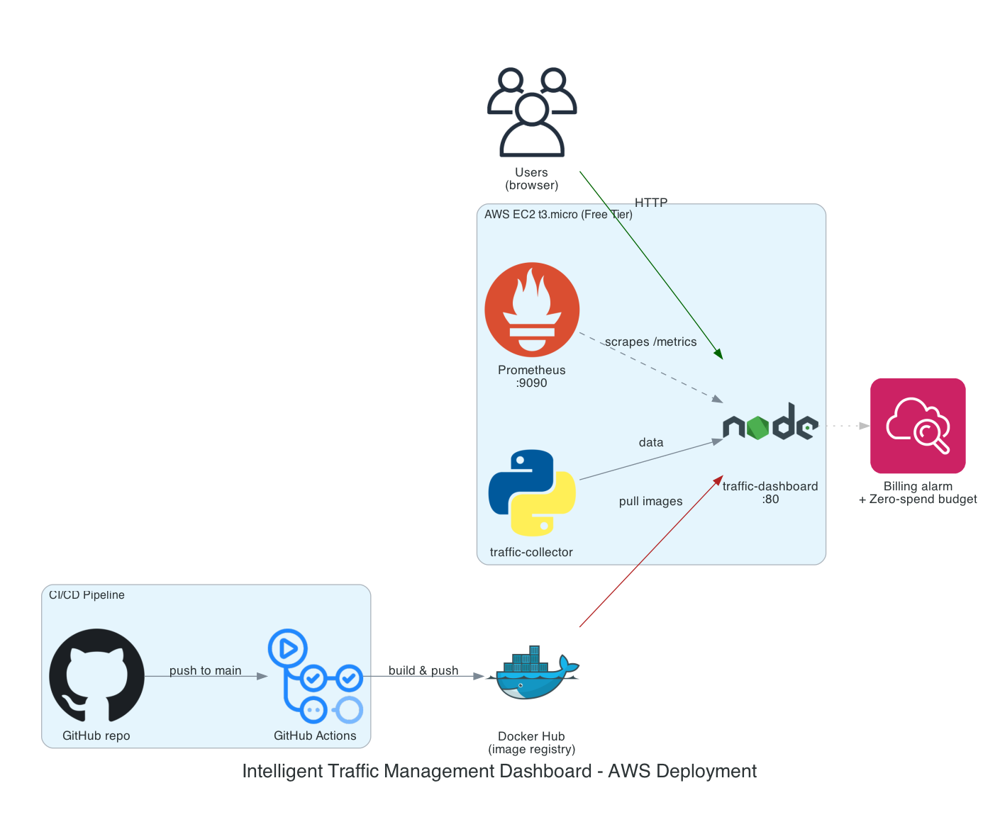

# Intelligent Traffic Management Dashboard
## Architecture


**Drive Link:** https://drive.google.com/drive/folders/1-Q9L_qYiQUs13soYEqLijQGZFUDaiGQo?usp=sharing

**Team Members:**
- Lama Ossama
- Mariam Yasser
- Nouran Atef
- Mohamed Ossama
- Youssef Mustafa

## Project Overview
Cities face challenges in monitoring traffic congestion and reacting quickly to peak times and incidents. This project provides a real-time traffic monitoring system that collects simulated traffic sensor data and displays insights through a dashboard.

The solution focuses on DevOps practices including containerization, Linux-based automation commands, monitoring, and scalable deployment.

## Project Objectives
- Collect traffic data from simulated IoT sensors or CSV logs.
- Display real-time traffic congestion metrics.
- Detect peak times and traffic situations.
- Deploy services using Docker and Kubernetes.
- Monitor the dashboard service with Prometheus.
- Use Nginx as a reverse proxy.

## Tools & Technologies
- Docker
- Kubernetes
- Prometheus
- Nginx
- Git / GitHub
- Linux commands and Bash-friendly workflows

## AWS Deployment (Terraform)
The `terraform/` module provisions an alternative, non-Kubernetes deployment on EC2. Its defaults are tuned to stay inside the AWS Free Tier (Jenkins EC2 instance off by default, Free-Tier-only instance types enforced, EBS/S3 sized and cleaned up to avoid unexpected charges). See [`terraform/README.md`](terraform/README.md) before running `terraform apply`, and always run `terraform destroy` when you're done testing.

## Prometheus Monitoring
Prometheus was added as the monitoring part of this DevOps project. The dashboard service exposes a `/metrics` endpoint, and Prometheus scrapes it through the internal Docker Compose network.

This is useful for the final demo because the team can show:
- the application dashboard running on port `3002`
- the Prometheus server running on port `9090`
- live metrics collected from the traffic dashboard container
- the health of the Prometheus scrape target

### Monitoring Files
- `prometheus/prometheus.yml`: Prometheus scrape configuration.
- `docker-compose.yml`: Adds the Prometheus container to the local environment.
- `traffic-dashboard/server.js`: Adds `/health` and `/metrics` endpoints.
- `traffic-dashboard/package.json`: Adds the Prometheus client library for Node.js metrics.

### Metrics Exposed by the Dashboard
The dashboard exports default Node.js process metrics and custom traffic metrics:

- `traffic_dashboard_records_total`: total number of CSV traffic records loaded by the dashboard.
- `traffic_dashboard_vehicles_total`: total vehicle count from the dataset.
- `traffic_dashboard_average_vehicles`: average number of vehicles per traffic record.
- `traffic_dashboard_situation_records{situation="..."}`: number of records for each traffic situation.

## Grafana Dashboards
Grafana visualizes the same metrics Prometheus scrapes, with a pre-provisioned Prometheus datasource and a "Traffic Dashboard Overview" dashboard (service status, records/vehicles totals, situation breakdown, vehicles over time).

### Monitoring Files
- `monitoring/grafana/provisioning/datasources/datasource.yml`: auto-registers the Prometheus datasource.
- `monitoring/grafana/provisioning/dashboards/dashboard.yml`: tells Grafana to load dashboards from `monitoring/grafana/dashboards/`.
- `monitoring/grafana/dashboards/traffic-dashboard.json`: the dashboard itself.
- `docker-compose.yml`: mounts the above into the `grafana` container and adds it to the Compose network.

### Run Locally on Linux
Grafana's admin password is required and is **not** committed to git. Before the first run:

```bash
cp .env.example .env
# edit .env and set GRAFANA_ADMIN_PASSWORD to something real
```

From the project root, run:

```bash
docker compose up --build
```

Open the application dashboard:

```bash
xdg-open http://localhost:3002
```

Open Prometheus:

```bash
xdg-open http://localhost:9090
```

Open Grafana (log in with the credentials from `.env`):

```bash
xdg-open http://localhost:3000
```

Check the raw metrics endpoint:

```bash
curl http://localhost:3002/metrics
```

Check Prometheus targets:

```bash
xdg-open http://localhost:9090/targets
```

### Alerting
`prometheus/alert_rules.yml` defines two alert rules, loaded via `rule_files:` in `prometheus/prometheus.yml`:
- `TrafficDashboardScrapeDown`: fires if Prometheus can't scrape the dashboard for 1 minute.
- `TrafficDashboardNoTrafficRecords`: fires if the loaded record count is 0 for 2 minutes.

View firing/pending alerts at `http://localhost:9090/alerts`. No Alertmanager is wired up yet, so alerts are visible in the Prometheus UI but don't route to a notification channel (Slack/email/etc.) -- add an `alertmanager` service and a receiver config if that's needed.

### Prometheus Demo Queries
Use the Prometheus query page at `http://localhost:9090` and try:

```promql
up{job="traffic-dashboard"}
```

```promql
traffic_dashboard_records_total
```

```promql
traffic_dashboard_vehicles_total
```

```promql
traffic_dashboard_situation_records
```

### Stop the Environment
```bash
docker compose down
```
